# Java网络聊天室实验报告(第48组)
### 小组成员
+ 18342005 曹鉴恩
+ 18342016 范建聪
### 代码开源
本项目的所有代码已经开源在
```
https://github.com/caojen/java_chat_room
```
git仓库：
```
https://github.com/caojen/java_chat_room.git
```

## 项目背景与需求分析
&ensp;&ensp;&ensp;&ensp;随着互联网通信技术的迅速普及，人们通过网络技术进行线上交流。聊天室（如QQ，微信聊天）的即时聊天能够满足了用户的需求。

&ensp;&ensp;&ensp;&ensp;在此背景下，本系统设计的聊天室能够满足用户的正常需求，即支持多人在线聊天，即时显示房间列表和房间内部成员，同时聊天室房主可以随时删除房间内部成员以及删除房间。除此之外，本系统还加入了管理员身份，拥有管理员身份的用户可以拥有房主的所有权限，便于系统内部人员进行管理。对于其他普通用户而言，本系统提供注册和登录接口，允许用户随时创建新的ID加入本系统中。

&ensp;&ensp;&ensp;&ensp;本系统采用前后端分离进行设计，如此设计是为了能够便于迁移后端，前端可以通过输入后端所在Ip地址就可以连接不同的服务器。

## 后端设计
### 开发环境
+ 后端开发与环境搭建已经在Win10和Ubuntu下调试通过，并采用命令行进行编译与运行
+ 对于Win10环境
```bat
java -version
>>> java version "1.8.0_231"
>>> Java(TM) SE Runtime Environment (build 1.8.0_231-b11)
>>> Java HotSpot(TM) 64-Bit Server VM (build 25.231-b11, mixed mode)

javac -version
>>> javac 1.8.0_221
```
+ 对于Ubuntu环境
```bash
$ java -version
# openjdk version "1.8.0_222"
# OpenJDK Runtime Environment (build 1.8.0_222-8u222-b10-1ubuntu1~16.04.1-b10)
# OpenJDK 64-Bit Server VM (build 25.222-b10, mixed mode)
$ javac -version
# javac 1.8.0_222
```

### 后端编译以及启动方式
*为了便捷，只介绍在Win10下的命令方式，Ubuntu下的命令略有不同时会重点说明。下同*
+ 编译方式：
```bat
javac -cp sqlite.jar; Backend/Main.java
```
+ 运行方式：
```bat
java -cp sqlite.jar; Backend.Main
```
*要在Linux下编译/运行，请将其中的‘;’改为‘:’*
+ 运行情况截图：
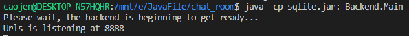

### 后端设计开发模式简介
+ 本系统后端开发中参考了MVC的设计思想，M(Model)代表用户身份，C(Control)为修改数据库的主类，V(Views)是后端响应前端的主类（定义了Url和对应的Response）。
+ 在设计目录结构是，我们参考了Python-Django后端的Model-View-DataBase模式，其中，我们采用Sqlite作为我们的数据库。
+ 本系统在前后端连接时没有采用Socket，而是使用GET-POST请求与短轮询方式进行数据获取。

### 权限控制
不同的身份将有不同的权限，下表为所有身份的权限列表  

|Model|Same as|Enter Room|Delete Room|Create Room|Delete Participant in Room|
|:-:|:-:|:-:|:-:|:-:|:-:|
|Admin|-|1|1|0|1|
|All User|-|1|-|1|-|
|Owner|Participant(User)|1|1|-|1|
|Participant in Room|Participant(User)|-|0|-|0|

+ 1为可以，0为拒绝，-为无关

### 后端类图关系
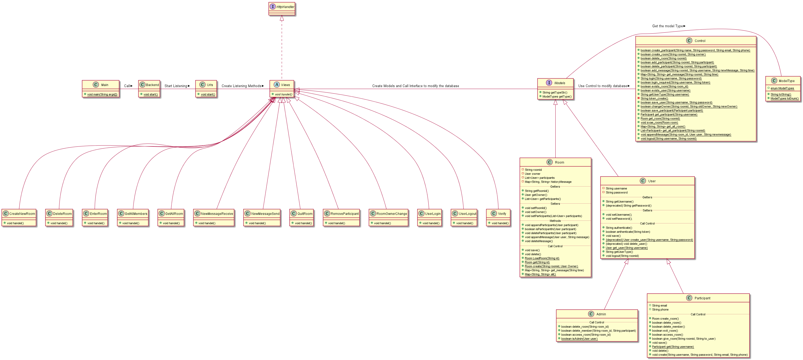
**如果遇到文字不清晰情况，请访问Report文件夹下的images/backend_uml.jpg**
### 后端处理请求逻辑与流程简介
在本系统后端中，Url创建监听的端口以及映射的路径，Views创建对应的事件。
1. 前端发送GET/POST请求到相应的URL中，后端由Url映射到Views的事件
2. 判断该事件的请求类型是否满足要求（例如：用户登录只允许POST请求），不满足则直接返回403错误
3. 判断该请求是否符合逻辑（如验证身份等），逻辑成功则执行并返回200，逻辑失败或执行时遇到错误则返回相应错误码
4. 请求成功时将会对数据库进行修改，Views调用Control进行数据库访问，Control类中已经封装了相应方法并使用SQL语句对database进行修改

### 后端关键模块逻辑说明
#### Models模块
+ Models模块定义了用户的属性和方法，或房间的属性和方法。
+ （参考自Python-Django设计方法）View可以通过每个Model的get/load方法进行对象的获取，例如提供用户名和密码对Participant进行'获取'，如果遇到需要修改属性的事件时，View除了调用setters修改当前对象时，还需要调用对象的save方法将修改后的内容保存到数据库中（如果不需要保存到数据库中便可以不调用save方法以减少对数据库的调用频率）。这种做法的原因是考虑到数据库进行写操作时所占时间延迟较大，因此可以先保存到'当前'内存，等到请求结束再统一写入数据库。
  
#### Control模块
+ Control模块提供了访问数据库的接口方法
+ 由于对Sqlite数据库进行修改需要使用SQL语句，而写SQL语句是相对繁琐的。因此可以考虑将所有需要修改的SQL语句封装起来成为一个方法，需要时再进行调用，可以减少开发时间并提高可读性与代码正确性。
+ 需要注意的是，Control模块并没有进行权限控制，权限控制需要由View对Model进行操作（例如登录控制，删除房间权限控制，删除房间成员权限控制），只有当权限足够时，View才能调用Model相应方法(Model再对Control进行方法调用)对数据库进行操作。

#### Url模块与Views模块
+ Url模块使用了HttpServer对指定端口监听请求，并使用HttpServer的CreateContext方法创建映射。
+ 所有的映射响应方法都继承自Views，而Views又实现了HttpHandeler这个接口。

### 后端知识点应用说明
在实现后端时，我们主要使用的知识点为：
1. 不采用Socket建立长连接，而使用HttpServer建立短链接（以提供**短轮询**接口）
2. 建立Views模块时，实现了Java.net内置的HttpHandeler**接口**
3. 创建Models时，定义了Models接口，并在创建了**超类**User（被Participant和Admin**继承**）
4. 使用**数据库**（Sqlite）保存数据

### 后端难点说明
在实现后端时，难点在于：
1. 实现各个View模块的逻辑较复杂，涉及到权限控制等方面，条件判断语句较多，导致调试周期长
2. 对于数据库建表时，由于缺乏可视化工具，调试表中数据较难
3. 在实现Control各个方法时，由于需要写大量的SQL语句，容易出错

### 后端中仍未解决的问题
+ 在后端设计中我们实现完成度较高，已经能够完成所有的逻辑处理，可以满足前端需求。
+ 后端的权限控制完成度较高，对于越权请求，后端能够正确处理并且向前端返回403异常

### 其他说明
后端已经部署在服务器上，ip=39.98.244.149，port=8888。如果需要验证服务器是否有相应，请在浏览器中访问
```
http://39.98.244.149:8888/verify/
```
进行验证, 前端也可以使用这个ip和port访问该服务器所在后端


## 前端设计
+ 说明： 对于客户端，我们提供了两种模式，一种是命令行模式，另外一种是UI界面，两种模式并无优劣之分，只是使用上有区别。在本实验报告中，我们将先使用**UI界面**进行说明，在对命令行模式的客户端进行补充介绍。

### UI界面-开发环境
在开发UI界面时，本系统只测试了在Win10的情况，并且在Win10上运行通过。
```bat
java -version
>>> java version "1.8.0_231"
>>> Java(TM) SE Runtime Environment (build 1.8.0_231-b11)
>>> Java HotSpot(TM) 64-Bit Server VM (build 25.231-b11, mixed mode)

javac -version
>>> javac 1.8.0_221
```
本系统的UI界面是使用java的swing库

### UI界面-编译以及启动方式（只支持Win10）
+ 编译UI界面
```
javac FGUI/Main.java
```
+ 运行：
```
java FGUI.Main
```
+ 前端UI界面已经打包在根目录的FGUI.jar，请在Windows环境下运行即可
### UI界面截图以及运行情况简介
1. 在运行UI界面，可以首先手动输入后端地址
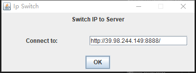
2. 在输入有效后端地址后（如果后端地址无效则需要重新输入），可以进行用户注册或用户登录

3. 用户登录后，可以进行选择1. 退出登录；2. 创建房间；3. 选择房间。注意，由于权限控制放在后端，根据后端的权限规则，如果登录的用户的用户类型是Admin，则无法创建房间  
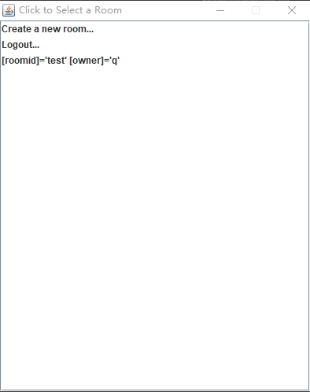
4. 选择房间后，可以对房间进行操作：1.删除房间；2. 进入房间。根据权限规则，当且仅当当前用户是Admin或房间房主时才可以删除房间。  
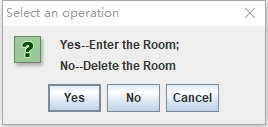

1. 进入房间后，用户可以1. 查看当前信息；2. 发送信息；3. 查看用户列表。注意，用户列表下的两个按钮依然收到后端的权限控制（即使普通用户能够点击，但是只有Admin或房主才能够进行操作）  
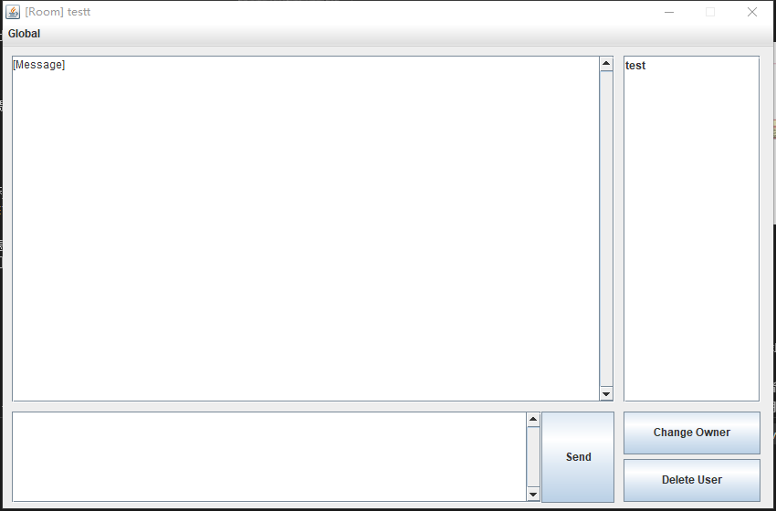

### UI界面类图
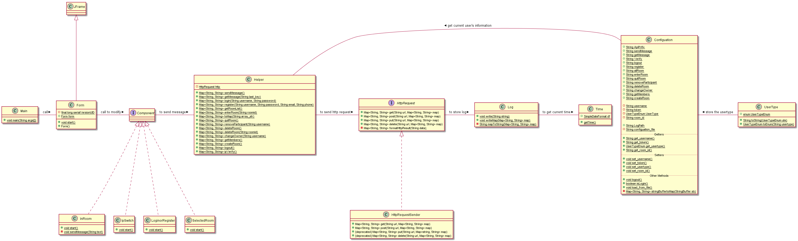
**如果遇到文字不清晰情况，请访问Report文件夹下的images/frontend_uml.jpg**
### UI界面逻辑与流程说明
UI界面的逻辑如下：
1. 主窗体是Form，Component能够修改Form的显示内容
2. 用户登录/注册/进入房间等信息都存放在Configuation中，除此之外，前端向后端发送信息的url地址都以变量的形式存放在Configuation中
3. 根据不同的Component，不同的按钮/文本框/初始值的获取都通过调用Helper模块实现
4. Helper可以通过Configuation获取当前用户状态信息，并调用HttpRequest发送Http请求
5. HttpRequest发送请求前/后都需要通过Log类写临时文件（方便调试和观察数据，为了避免安全性问题，不写入关键数据）
6. Log类将通过Time类获得当前时间

UI界面异常事件触发处理:

1. 用户被(房主或管理员)移除,则断开消息接收并再用户列表删除此用户
2. 房间被删除,则断开消息接受列表,清空用户列表
3. 阻止普通用户的一切越权行为(普通用户无法删除其他用户,无法删除房间)
4. 管理员和房主的权限相同,这将导致房主无法被直接删除,但管理员有权利转移房主权限

### UI界面关键模块说明
UI界面的关键模块主要分为三部分
1. 界面设计模块，主要为Form和Component。该两模块定义了每个界面的流程关系，并且根据不同的进程点展示不同的界面
2. Helper模块和HttpRequest模块，这两个模块主要处理发送请求部分。根据后端的规则，需要发送GET/POST请求
3. Component的InRoom模块。当用户进入房间时需要展示InRoom模块界面。该界面主要由三部分组成：1. 展示新信息，该文本框需要定义一个进程，该进程每隔一段时间t便发送一个请求，后端需要根据请求内容（请求内容为当前前端最新的信息的时间）获得新信息（后端只需要把大于该时间的信息返回即可）；2. 发送信息，该模块不需要进程，改用按钮事件进行发送；3. 展示房间内用户，该模块需要添加一个进程，每个一段时间t便发送一个请求，获得当前房间的所有用户。如下图所示：

### UI界面知识点说明
在设计UI界面时，我们应用到了以下知识点：
1. 可视化界面使用了**swing**
2. 实现了Component**接口**，实现了HttpRequest接口
3. 在请求消息和请求房间用户时采用了**多线程**的做法
4. 在程序初始化时，程序会读取FGUI/Configuation/Configuation.cfg初始化数据，以及会写入Log，这些应用了**文件处理和存储知识**
5. 由于后端返回的错误是多样化的，因此Helper需要对HttpRequest抛出的错误进行**错误处理**

### UI界面难点说明
+ UI界面的难点主要在于设计界面方面。此外还有利用多线程请求数据会出现较多Bug，调试时间长，而且处理用户退出再登录的事件容易出错。

### UI界面未解决问题
+ 经测试，UI界面已经完成了其基本功能，并已经克服了上述难点。

### 其他说明
除了提供UI界面外，我们还实现了基于命令行的前端界面。该界面在Win10和Ubuntu下运行通过
#### 命令行前端-开发环境
+ 对于Win10环境
```bat
java -version
>>> java version "1.8.0_231"
>>> Java(TM) SE Runtime Environment (build 1.8.0_231-b11)
>>> Java HotSpot(TM) 64-Bit Server VM (build 25.231-b11, mixed mode)

javac -version
>>> javac 1.8.0_221
```
+ 对于Ubuntu环境
```bash
$ java -version
# openjdk version "1.8.0_222"
# OpenJDK Runtime Environment (build 1.8.0_222-8u222-b10-1ubuntu1~16.04.1-b10)
# OpenJDK 64-Bit Server VM (build 25.222-b10, mixed mode)
$ javac -version
# javac 1.8.0_222
```
#### 界面展示
1. 选择ip地址，输入新的ip地址或者按回车使用默认ip地址
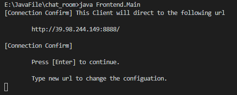
2. 进行操作选择（注册、登录或退出）  
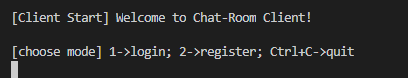
3. 注册界面  
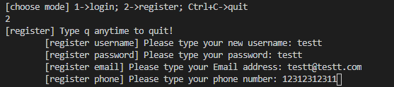
4. 登陆界面  
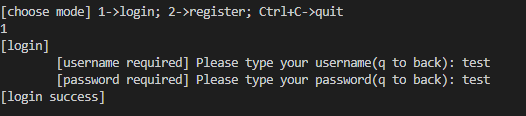
5. 选择房间界面  
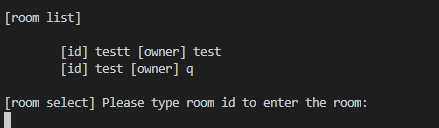
6. 进入房间并发送信息界面  
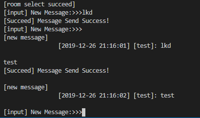
7. 展示当前房间用户，使用#showmember命令  
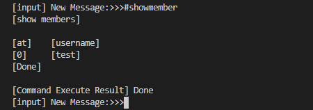

更多命令包括
+ #showmember 显示房间所有成员
+ #deleteroom 删除此房间（权限控制）
+ #ownerchange \<newownername\> 更改房间房主（权限控制）
+ #createroom \<roomid\> 创建房间（Admin不允许创建）
+ #logout 登出，返回到初始界面

#### 其他
命令行界面与UI界面内部基本一致，在此不再赘述

## 前后端设计总结
+ 本聊天室系统中，我们采用了前后端分离模式，后端使用Sqlite数据库保存数据，前端使用命令行界面和UI界面进行数据展示与用户沟通。前后端通过GET/POST请求进行数据交互，基本完成了网络聊天室的工作需求。
+ 在进行前后端设计时，我们使用了以下知识点：


|知识点|具体体现于|
|-|-|
|网络编程|不同的客户端通信依赖于相同的服务端|
|UI界面|UI前端使用了Swing|
|文件存储|1. 前后端都有保存Log的功能|
||2. 前端运行前会读取configuation.cfg文件（保存有初始值参数）|
|类和对象|为不同的用户区分身份|
|超类与继承|不同的用户均继承于User类，User和Room类为Models的子类|
|接口及其实现|1. 使用并实现了Java内置的HttpServer接口|
||2. 使用了SQL接口（引用了jar包 'sqlite.jar'）|
||3. 在实现http请求类时，先设计了接口，再进行实现|
|异常处理|在SQL数据库操作、Http请求、命令行前端处理错误输入、权限控制等都做了异常处理|
|多线程|1. 在命令行前端中，我们创建了两个新线程，一个接受当前用户输入并发送到服务端，另一个线程获得服务端的新信息|
||2. 在UI前端中，我们同样使用了两个新线程，一个线程获得服务端的新信息，另外一个线程获得当前房间的用户列表信息|
|数据库|后端使用Sqlite数据库保存数据|
|设计模式参考|在本实验中我们参考了MVC模式、Python-Django后端编程模式等网络编程思想|

+ 完成度总结: 该项目的完成度较高,对于基本的功能已经能够正确实现.

### 项目目录树

+ 本项目目录树以文件形式存放在根目录下的tree中。
+ 以下为本实验报告的目录树，实验报告中出现的图片均以保存在对应位置。
```
./Report
├── images
│   ├── backend1.png
│   ├── backend_uml.jpg
│   ├── frontend1.png
│   ├── frontend2.png
│   ├── frontend3.png
│   ├── frontend4.png
│   ├── frontend5.png
│   ├── frontend_1.png
│   ├── frontend_2.png
│   ├── frontend_3.png
│   ├── frontend_4.png
│   ├── frontend_5.png
│   ├── frontend_6.png
│   ├── frontend_7.png
│   └── frontend_uml.jpg
├── report.md
└── umls
    ├── backend.uml
    └── frontend.uml

2 directories, 18 files
```